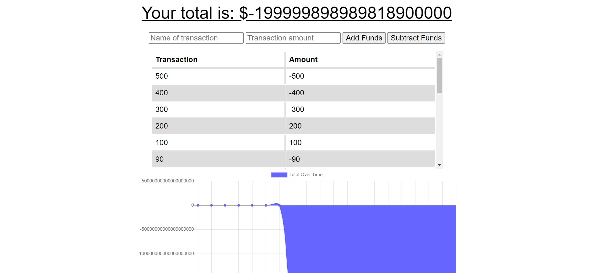
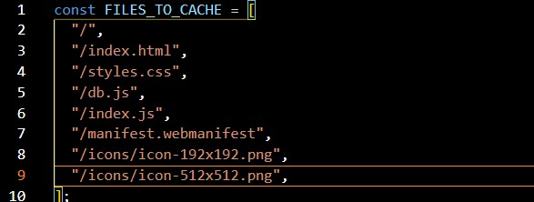

# PWA Budget Tracker - Online/Offline Budget App

## Overview

PWA Budget Tracker is a budget tracker app that allows a user to track their deposits and expenses, whether online or offline, using IndexedDB, service-worker.js, manifest-webmanifest, Mongoose and Atlas.

## Table of Contents

- [Description](#description)
- [Installation](#installation)
- [Usage](#usage)
- [Test](#test)
- [Deployed](#deployed)
- [Tools](#tools)
- [Research](#research)
- [Questions](#questions)
- [License](#license)

## Description

To online create deposits and expenses data, Express, Mongo with a Mongoose schema, Heroku were utilized to:

- Serve and display a chart.js chart of deposits and expenses.

Offline deposits and expenses data are served as chart.js using IndexedDB, service-worker.js and manifest-webmanifest.

## Installation

1. Create a .gitignore file and include node_modules, .DS store and .env. This ensures that the node_modules directory and your Atlas credentials aren't tracked or uploaded to GitHub.
2. Use the command-line, npm i, to install Express, dotenv, and mongoose npm, morgan npm and compression npm.
3. To start tracking deposits and expenses using Express, use the command, node server.js and navigate in the web browser to localhost:8080.

## Usage

- Express, Heroku and chart.js are used to serve and display to the user
- their expenses online and offline

## Test

Test the different routes on the local host using Morgan npm, to ensure that they are firing and the Mongoose database is accessed.

## Deployed

- \*[Deployed website](https://still-crag-09430.herokuapp.com/)
- \*[GitHub Repository](https://github.com/Kay0s/BudgetTracker) 

### Screenshot of Files Cached

## Tools

- mongo DB
- dotenv npm
- Mongoose
- HTML
- CSS
- JavaScript
- .gitignore
- Git Bash
- Heroku
- Express
- node.js
- morgan npm
- service-worker.js
- manifest-webmanifest
- compression npm
- chart.js
- Bootstrap
- Font Awesome

## Research

- [Google Developes - Service Worker](https://developers.google.com/web/ilt/pwa/introduction-to-service-worker)
- [MDN Web Docs - Web app manifests](https://developer.mozilla.org/en-US/docs/Web/Manifest)
- [Chart.js](https://www.chartjs.org/)

## Questions

- [Email](hamilton.kristina@gmail.com)
- [GitHub Profile](https://github.com/Kay0s)
- [GitHub Repository](https://github.com/Kay0s/BudgetTracker)

## License

© 2021 Kristina Hamilton and Trilogy Education Services, a 2U, Inc. brand. All Rights Reserved. Permission is hereby
granted, free of charge, to any person obtaining a copy of this software and associated documentation files (the
"Software"), to deal in the Software without restriction, including without limitation the rights to use, copy, modify,
merge, publish, distribute, sublicense, and/or sell copies of the Software, and to permit persons to whom the Software
is furnished to do so, subject to the following conditions:

The above copyright notice and this permission notice shall be included in all copies or substantial portions of the
Software.

THE SOFTWARE IS PROVIDED "AS IS", WITHOUT WARRANTY OF ANY KIND, EXPRESS OR IMPLIED, INCLUDING BUT NOT LIMITED TO THE
WARRANTIES OF MERCHANTABILITY, FITNESS FOR A PARTICULAR PURPOSE AND NONINFRINGEMENT. IN NO EVENT SHALL THE AUTHORS OR
COPYRIGHT HOLDERS BE LIABLE FOR ANY CLAIM, DAMAGES OR OTHER LIABILITY, WHETHER IN AN ACTION OF CONTRACT, TORT OR
OTHERWISE, ARISING FROM, OUT OF OR IN CONNECTION WITH THE SOFTWARE OR THE USE OR OTHER DEALINGS IN THE SOFTWARE.
